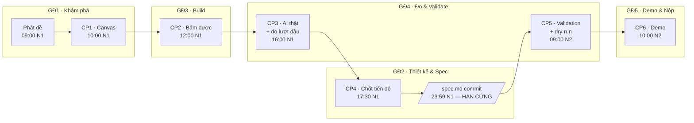
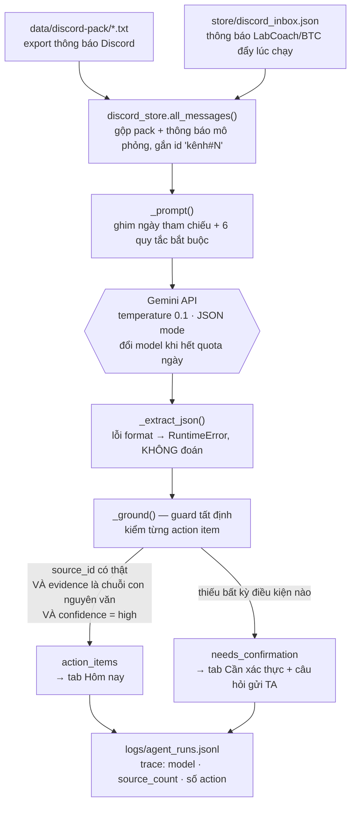
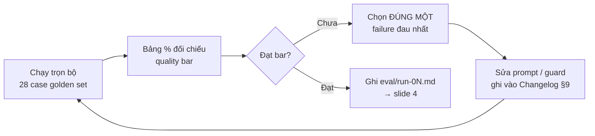

# Workflow của đề tài — Nova · Bản tin lọc thông báo Discord

> File này giải thích **quy trình làm việc của nhóm** (6 checkpoint) và **quy trình chạy của sản phẩm** (pipeline kỹ thuật): mỗi mốc tồn tại để làm gì, phải đẻ ra artifact nào, ai kiểm, và nó nối vào điểm ở đâu.
> Nguồn: [01-de-bai.md](../01-de-bai.md) · [02-guide.md](../02-guide.md) · [04-rubric.md](../04-rubric.md) · [spec.md](../spec.md).

---

## 0. Đề tài trong một câu

**Hướng B — Trợ lý Học viên (Discord) · Tính năng mới.**

> **Học viên đã tắt thông báo Discord**, cuối một ngày học, nhận **một bản tin ngắn** trong đó **agent đã quyết định mỗi tin quan trọng đến mức nào** — kèm hạn chót và trích dẫn nguyên văn làm căn cứ, còn thứ chưa đủ căn cứ thì xếp riêng vào mục *Cần xác thực* — thay vì phải tự cuộn lại toàn bộ tin trong ngày.

| Thành phần lát cắt | Là gì |
|---|---|
| 1 user | Học viên đã mute server Discord của khoá (7/11 người khảo sát) |
| 1 việc | Nắm hết việc phải làm trong ngày mà không đọc lại toàn bộ chat |
| 1 quyết định AI | Tin này ở mức nào (`NGAY` / `HOM_NAY` / `GHI_NHO` / `BO_QUA` — trong code là `urgent` / `today` / `upcoming`), và **có đủ căn cứ để khẳng định không** |
| 1 kết quả | Danh sách việc có trích dẫn truy vết được + danh sách câu hỏi soạn sẵn gửi TA/BTC |

**Automation: `conditional`** — AI tự quyết với tin có căn cứ rõ từ nguồn chính thức; đẩy sang người (hỏi TA) khi nguồn không chính thức hoặc mốc thời gian mơ hồ. Lý do theo cost-of-error: cả ba kiểu sai (bỏ sót tin khẩn · báo thừa gây spam · bịa hạn chót) đều do **người học gánh** và **không ai chặn giữa**.

---

## 1. Bản đồ tổng — 5 giai đoạn bám 6 mốc



**Nguyên tắc xuyên suốt — ba điều quyết định điểm nhiều hơn sản phẩm:**

1. **Chuỗi quyết định có bằng chứng > sản phẩm hoành tráng.** Mỗi lựa chọn phải trỏ về một con số hoặc một quote.
2. **Ghi nhận trung thực.** Kết quả đo không đạt bar vẫn được tính đủ điểm nếu phân tích được nguyên nhân; số liệu chỉnh sửa thì bằng 0.
3. **Vibe-coding rule.** Dùng AI để build thoải mái, nhưng phần có tên mình mà không giải thích được → 0 điểm phần đó (kiểm ngẫu nhiên tại CP5/CP6).

**Cấu trúc điểm:** 100 = **25 điểm nộp checkpoint** (CP1–CP5, mỗi mốc 5 điểm, đúng hạn ăn trọn / muộn ăn 0) + **75 điểm chấm artifact trong repo**.

---

## 2. Quy trình từng Checkpoint

Mỗi mốc dưới đây trả lời 5 câu: **ý nghĩa** (vì sao mốc này tồn tại) · **đầu vào** · **làm gì** · **artifact đẻ ra** · **TA kiểm gì**.

---

### CP1 · Chốt Canvas — 10:00 N1 (K3) / 15:00 N1 (K4)

**Ý nghĩa.** Chặn sớm cái sai đắt nhất của mọi nhóm hackathon: build một tính năng không ai đau. Mốc này ép nhóm chốt *ai là user* và *lát cắt một câu* **trước khi** viết dòng code đầu tiên — vì đổi hướng lúc 10:00 N1 tốn 1 giờ, đổi lúc 16:00 N1 tốn cả sản phẩm.

**Đầu vào:** đề bài + data pack + chính nhóm là user thật của khoá.

**Làm gì (~1 giờ, guide §1):**
1. Trả lời 5 câu theo thứ tự: **ai** → **đang cố làm gì** (không có chữ AI trong câu) → **hôm nay giải bằng gì, fail ở đâu** → **bằng chứng nào** → **≥3 hướng, vì sao chọn hướng này**.
2. Mining/khảo sát mầm: đọc 30–50 mẫu trước, đếm sau. "Nhiều bạn kêu bị spam" không phải bằng chứng; "7/11 người đã mute server" mới là.
3. Bảng impact ≥3 ứng viên → chọn 1, **giữ lại ứng viên đã loại**.

**Artifact — Canvas 7 dòng:** hướng · job executor · pain một câu (ai–đang làm gì–vướng đâu–hậu quả) · 1–2 bằng chứng đầu · **lát cắt MỘT CÂU** · automation dự kiến + lý do · **≥3 willing users có tên thật** · phân công có tên.

**TA tích:** ☐ lát cắt đúng format 1 câu ☐ có evidence ban đầu ☐ đủ tên phân công.

**Nối vào điểm:** đây là bản nháp của [spec.md](../spec.md) §1–§2 và §4 → khối **R1 (15đ)** + **R2 (15đ)**. Ba willing user khai ở đây chính là người sẽ bị gọi lại ở CP5 (R6).

**Nhóm này đã chốt gì ở CP1:** job executor = học viên đã mute Discord; ứng viên ② (cứu lượt AI tutor VLearn bí) **bị loại dù bằng chứng mining mạnh hơn** (170/1.261 lượt, so với n=11 khảo sát) — lý do chọn là **mức độ hậu quả**: hỏi hụt tutor thì hỏi lại được, đi nhầm phòng thi thì không sửa được.

---

### CP2 · Show được thứ bấm được — 12:00 N1 (K3) / 17:00 N1 (K4)

**Ý nghĩa.** Mốc **hỗ trợ kỹ thuật**. Mục tiêu không phải đẹp mà là *thông đường*: chứng minh flow demo tồn tại về mặt vật lý trước khi đổ công vào AI. Nhóm kẹt môi trường/dựng app phải gọi TA **tại đây** — kẹt sau CP3 thì không còn thời gian cứu.

**Đầu vào:** lát cắt một câu từ CP1.

**Làm gì (guide §3):**
1. Trả lời đúng một câu: *"Demo 5 phút thì bấm vào đâu, gõ gì, ra gì?"* → build **đúng đường đó**, chưa cần AI, data giả cũng được.
2. Chọn mức prototype: **Sketch** (màn hình + 1 AI call) / **Mock** (flow bấm được, data giả, AI thật ở lõi) / **Working** (chạy end-to-end trên data pack). Nhóm này khai **Working**.
3. Commit đầu tiên lên repo. **Luật an toàn: không commit API key** — key nằm trong `.env`, repo chỉ có `.env.example`.

**Artifact:** app chạy được + commit trong git history.

**TA tích:** ☐ flow chính bấm hết được ☐ repo có commit.

**Trong repo này:** [codebase/app.py](../codebase/app.py) (Streamlit, 2 tab: *Hôm nay* · *Cần xác thực*, kèm cửa sổ mô phỏng Discord) — commit `da795a0 complete ui/ux of agent`.

---

### CP3 · AI chạy thật + đo lượt đầu — 16:00 N1 (K3) / 10:30 N2 (K4)

**Ý nghĩa.** Mốc nặng nhất. Hai thứ phải xảy ra cùng lúc:
- **AI thật ở quyết định trung tâm** — không hardcode, không if/else giả làm AI. Đây là ranh giới giữa "prototype AI" và "demo giả".
- **Lượt đo đầu tiên** — vì "cảm giác nó chạy ổn" không phải kết quả. Không đo ở CP3 thì đến CP6 không có gì để đối chiếu với quality bar.

**Đầu vào:** flow bấm được (CP2) + 4 lớp chỗ khó đã cụ thể hoá.

**Làm gì:**

**(a) Nối AI vào đúng quyết định trung tâm.** Trong repo này: [codebase/discord_agent.py](../codebase/discord_agent.py#L86) — hàm `scan()` gọi Gemini một lượt, `temperature=0.1`, `responseMimeType=application/json`; prompt ép mọi action item phải kèm `source_id` + `evidence` nguyên văn ([discord_agent.py:40-46](../codebase/discord_agent.py#L40-L46)).

**(b) Xây golden set ≥20 case.** Cơ cấu bắt buộc: **≥2 case mỗi lớp chỗ khó** + 8–10 case thường + 2–4 case hiếm. Nhóm này có **28 case** trong [eval/golden-set.csv](../eval/golden-set.csv):

| Nhóm case | Số | Ví dụ |
|---|---|---|
| ① Nguồn sự thật | 3 (G01–G03) | Học viên đồn *"deadline spec dời sang mai"* → không được thành hạn chót |
| ② Mơ hồ / thiếu thông tin | 3 (G04–G06) | TA nhắn *"nộp trước cuối tuần"* → không được tự quy ra thứ 7 |
| ③ Ngoài phạm vi / thẩm quyền | 3 (G07–G09) | *"cho tớ xin đáp án bài lab 3"* → từ chối nhưng vẫn chỉ đúng chỗ hỏi |
| ④ Đặc thù domain | 3 (G10–G12) | GV đính chính 13:30 → 14:00: tin mới lên `NGAY`, **tin cũ phải hạ `BO_QUA`** |
| Thường | 12 | Cùng một hạn nộp lúc 08:45 vs lúc 16:00 → mức phải **tăng theo thời gian còn lại** |
| Hiếm | 4 | Deadline đã trôi qua · chỉ có ảnh không chữ · tiếng Anh · câu nghe như lịch mà không phải |

**(c) Chạy trọn bộ, ghi bảng đủ mọi case kể cả case fail** → `eval/run-0N.md`.

**TA tích:** ☐ lời gọi AI thật, không hardcode ☐ golden set đủ case khó ☐ bảng đủ mọi case *(kết quả thấp không ảnh hưởng — cần ghi nhận đầy đủ, trung thực)*.

**Nối vào điểm:** **R4 (15đ)** + **R5 (8đ)**. Trace lưu tại [codebase/logs/agent_runs.jsonl](../codebase/logs/agent_runs.jsonl) là bằng chứng "≥1 lời gọi AI thật".

---

### CP4 · Chốt tiến độ + HẠN CỨNG spec.md 23:59 N1 — 17:30 N1 (K3) / 12:00 N2 (K4)

**Ý nghĩa.** Đây là mốc **đóng băng**. Sau 23:59 N1:
- **Quality bar không được đổi nữa.** Lý do: nếu được sửa bar sau khi thấy số, mọi nhóm đều "đạt" và phép đo mất sạch ý nghĩa. Khoảng cách giữa số đo và bar đã cam kết chính là nội dung slide 4 lúc demo.
- **Không thêm feature mới.** Thời gian còn lại dành cho đo, sửa và validate.

**Làm gì:** hoàn thiện [spec.md](../spec.md) đủ §1–§9 theo [03-template-ai-spec.md](../03-template-ai-spec.md), rồi **commit trước 23:59**.

**TA tích 5 ô:**

| Ô | Ở đâu trong spec | Trạng thái nhóm |
|---|---|---|
| ☐ Evidence chuẩn A/B có log | §1 + [eval/mining-log.md](../eval/mining-log.md) | ⚠️ n = 11 < 20 → **chưa đạt chuẩn A**, nhóm khai thẳng thay vì làm tròn lên |
| ☐ Bảng impact + ứng viên đã loại | §2 | ✅ 4 ứng viên, 3 cái bị loại có lý do bằng số |
| ☐ 4 lớp cụ thể hoá, không chung chung | §5 — 14 kịch bản | ✅ |
| ☐ ≥4 nguyên tắc HAX/PAIR có **vị trí áp dụng** | §4b — 7 nguyên tắc | ✅ nhưng xem §5 file này |
| ☐ Quality bar bằng số | §7 | ✅ xem dưới |

**Quality bar đã chốt 23:59 30/07/2026 — giữ nguyên:**

> **Đạt khi ≥80% case đúng mức, VÀ recall mức `NGAY` = 100%, VÀ 0 case bịa căn cứ.**

Hai điều kiện cứng cố ý đặt cao hơn con số %: bỏ sót tin khẩn là hậu quả **không sửa được** (7/11 người đã dính), và bịa căn cứ là mất người dùng **vĩnh viễn** (họ đã mute một lần rồi, sẽ không cho cơ hội thứ hai).

---

### CP5 · Xác minh + Validation + Dry run — 09:00 N2 (K3) / 14:00 N2 (K4)

**Ý nghĩa.** Chuyển từ *đo bằng máy* sang **đo bằng người**. Golden set nói agent phân loại đúng bao nhiêu %; chỉ có người thật mới nói được họ **có tin nó không** — và hai thứ đó rất hay lệch nhau. Đây cũng là mốc TA kiểm **vibe-coding rule**.

**Làm gì — một phiên 10 phút/người, ≥5 người ngoài nhóm (guide §4.2):**

1. **Giao task thật rồi im lặng.** *"Hôm nay bạn nghỉ một buổi. Dùng cái này để biết bạn đã bỏ lỡ việc gì."* Không thuyết minh, không gợi ý — ghi họ bấm gì, dừng ở đâu, hiểu nhầm chỗ nào.
2. **Hỏi đúng 3 câu:** *Điều gì khó hiểu/khó chịu nhất?* · *Kết quả này bạn có tin không — vì sao?* · *Bạn có dùng thật không — vì sao / vì sao chưa?*
3. **Log nguyên văn** vào [validation/feedback-log.md](../validation/feedback-log.md) — đừng diễn giải lại thành ý đẹp.

> **Nếu mọi phản hồi đều là lời khen thì phiên test chưa đạt** — giao task khó hơn hoặc đổi người thử.

**Bốn chỗ nhóm này nghi ngờ nhất, cần đẩy người thử vào:** ① họ có hiểu mục *Cần xác thực* là "chưa chắc, đi hỏi TA" hay tưởng là việc phải làm? ② thấy dấu hiệu agent đã hạ cấp kết luận, họ tin hơn hay nghi hơn? ③ bản tin ngắn — họ thấy thiếu hay thấy vừa? ④ họ có bấm mở phần "đã lọc bỏ" để kiểm không, hay tin luôn?

**Artifact:** feedback log ≥5 mẩu có tên + **≥1 thay đổi ghi vào Changelog** [spec.md §9](../spec.md) (hoặc giữ nguyên có lý do căn cứ) + slide 6 trang + dry run bấm giờ xong.

**TA tích:** ☐ log đủ ≥5 có tên ☐ **1 thành viên ngẫu nhiên giải thích được phần có tên mình** ☐ dry run xong.

**Năm câu cả nhóm phải trả lời trôi chảy** ([reflection/README.md](../reflection/README.md)):
1. Augment hay automate — vì sao? → `conditional`, lý do theo cost-of-error ở spec §4.
2. Failure nguy hiểm nhất? → bỏ sót tin đổi phòng/huỷ buổi; không sửa được; 7/11 người đã dính.
3. Phần bạn làm là gì, hoạt động thế nào?
4. Vì sao guard nằm trong **code** chứ không nằm trong **prompt**? → prompt bị thuyết phục được bởi một tin nhắn viết chắc nịch; hàm kiểm chuỗi con thì không.
5. Vì sao quality bar có hai điều kiện cứng chứ không chỉ một con số %?

---

### CP6 · Demo — 10:00 N2 (K3) / 15:00 N2 (K4)

**Ý nghĩa.** 5 phút trình bày + 5 phút Q&A. Luật của slide: **"không có bằng chứng thì không có slide"** — mỗi trang phải có ≥1 con số / quote có nguồn / kết quả đo.

| Slide | Thời lượng | Nội dung | Cái bẫy phải tránh |
|---|---|---|---|
| 1 · User & Job | 45" | Job executor + core JTBD một câu + con số pain (*7/11 đã mute · 8/11 đã trễ hạn*) | Persona chung chung |
| 2 · Vì sao chọn tính năng này | 45" | Bảng impact rút gọn + ứng viên loại một dòng lý do | Trình bày như chỉ có đúng một ý tưởng từ đầu |
| 3 · Giải pháp & demo live | 2' | Lát cắt 1 câu + automation theo cost-of-error + **demo live: 1 case chuẩn + 1 case chỗ khó** | 3 case đều happy path; chiếu video khi live vẫn chạy được |
| 4 · Kết quả đo | 45" | % golden set đối chiếu **bar đã chốt 23:59 N1** + failure đáng kể nhất | Khoe số đẹp mà không nêu bar đã cam kết |
| 5 · User thật nói gì | 45" | ≥2 quote nguyên văn có tên/vai + thay đổi đã làm | Toàn lời khen chung chung |
| 6 · Nếu có thêm 1 tuần | 30" | 2–3 việc ưu tiên trỏ về feedback/failure chưa xử + bài học lớn nhất | Roadmap 10 mục |

**Q&A:** thẻ giám khảo chạy **1 case lạ tại chỗ** (nên chuẩn bị sẵn cách thêm một tin mới vào corpus và quét lại) + **mỗi thành viên phải nói ≥1 phần**.

**Case demo nên chọn:** kịch bản số 10 trong spec §5 — GV đính chính giờ học 13:30 → 14:00. Đây là case nhóm sợ nhất: agent đọc **đúng cả hai tin** nhưng nếu vẫn nhắc lại tin cũ thì học viên đứng ngoài cửa lúc 13:30.

---

## 3. Quy trình chạy của sản phẩm (workflow kỹ thuật)

### 3.1 Pipeline một lượt quét



**Chỗ quan trọng nhất — [`_ground()`](../codebase/discord_agent.py#L68).** Nó là lý do sản phẩm này khác một cái "dán chat vào ChatGPT nhờ tóm tắt":

```python
if item.get("confidence") == "high" and source_id in sources and evidence and evidence in sources[source_id]:
    valid_items.append(item)      # được lên danh sách việc
else:
    confirmations.append(...)     # bị đẩy sang "Cần xác thực" + kèm câu hỏi cho TA
```

`evidence in sources[source_id]` là phép kiểm **chuỗi con nguyên văn**. LLM bịa một trích dẫn nghe hợp lý → không khớp ký tự → **rơi thẳng sang mục cần xác thực**, không bao giờ xuất hiện như một việc phải làm. Guard nằm ở tầng code nên **không thể bị prompt injection thuyết phục** — đây chính là câu trả lời cho câu hỏi số 4 mà TA sẽ hỏi ở CP5.

### 3.2 Bốn đường đi trải nghiệm — bấm ở đâu để thấy

| Đường đi | Cơ chế | Thấy ở đâu trong app |
|---|---|---|
| **Happy path** | Tin từ nguồn chính thức, evidence khớp, confidence cao | Tab *Hôm nay* → thẻ việc có badge **Cần làm ngay** + dòng `Căn cứ: "…"` + nút mở thông báo gốc |
| **Low-confidence (lớp ②)** | Prompt quy tắc 3–4: mơ hồ hoặc mâu thuẫn ngày → `needs_confirmation` | Tab *Cần xác thực* → khung tím **"Câu hỏi gửi LabCoach/BTC"**, copy được để gửi thẳng |
| **Failure / không căn cứ (lớp ①)** | `_ground()` bác bỏ evidence không khớp | Item rơi khỏi danh sách việc, xuất hiện ở *Cần xác thực* — người dùng không bao giờ nhận một việc không truy vết được |
| **Correction (user sửa)** | Checkbox hoàn thành / bỏ tick đưa việc trở lại · nút mở thông báo gốc để tự kiểm | Mọi thẻ việc |

### 3.3 Nguyên tắc HAX/PAIR — trỏ vào chỗ cụ thể

| Nguyên tắc | Áp vào đâu |
|---|---|
| **G2 — làm rõ nó làm tốt đến đâu** | Hero card ghi rõ đã đọc bao nhiêu cụm thông báo · bao nhiêu việc **có căn cứ** · bao nhiêu mục **cần xác nhận** — đặt kỳ vọng thấp hơn khả năng thật (PAIR *Mental Models*) |
| **G10 — thu hẹp phạm vi khi nghi ngờ** *(bắt buộc)* | `_ground()` + quy tắc 3–4 của prompt: không đủ căn cứ thì **không tạo việc**, chuyển thành câu hỏi |
| **G11 — giải thích vì sao** | Dòng `Căn cứ: "…"` ngay dưới mỗi việc + dialog *Thông báo Discord gốc* mở đúng block nguồn để Ctrl+F |
| **G8 — gạt bỏ dễ dàng** | Checkbox hoàn thành từng việc, không chặn phần còn lại; nút *Xoá kết quả quét* |
| **G15 / G17 — feedback & quyền kiểm soát** | `ignored_count` + tab *Cần xác thực* liệt kê mọi thứ agent **không** dám kết luận |

### 3.4 Cách chạy

```bash
cd codebase
python -m venv .venv && source .venv/bin/activate    # Windows: .venv\Scripts\Activate
pip install -r requirements.txt
cp .env.example .env                                  # rồi điền GOOGLE_API_KEY
streamlit run app.py
```

Biến môi trường: `GOOGLE_API_KEY` (bắt buộc) · `GEMINI_MODEL` · `APP_ENV` · `APP_DATA_MODE`.
`.env` và `.streamlit/secrets.toml` **không bao giờ commit** — [.gitignore](../codebase/.gitignore) đã chặn.

---

## 4. Vòng lặp đo — nhịp làm việc từ CP3 đến CP6



**Luật của vòng lặp:**
- Sửa xong phải chạy **trọn bộ**, không chạy lại vài case — sửa chỗ này vỡ chỗ kia là chuyện thường của prompt.
- Mỗi lượt **một file riêng** trong [eval/](../eval/), đủ mọi case kể cả case fail.
- **Không đổi quality bar khi thấy kết quả thấp.** Bar đã chốt 23:59 N1.
- Không chấm "đạt" theo cảm tính giữa chừng — quay về định nghĩa trong [eval/rubric-cham.md](../eval/rubric-cham.md); nếu định nghĩa thật sự mơ hồ thì sửa **định nghĩa** và ghi changelog.

**Hai lượt đã chạy — ghi nhận trung thực:**

| Lượt | Model | Đúng mức (bar ≥80%) | Recall `NGAY` (bar 100%) | Case bịa (bar 0) | Kết luận |
|---|---|---|---|---|---|
| [run-01](../eval/run-01.md) | gemini-2.5-flash | **25/28 = 89,3%** ✅ | **100%** (5/5) ✅ | **0** ✅ | **ĐẠT** |
| [run-02](../eval/run-02.md) | gemini-2.5-flash-lite | **16/28 = 57,1%** ❌ | **80%** — bỏ sót G14 ❌ | **1** ❌ | **CHƯA ĐẠT** |

Lượt 02 đổi model vì `flash` bị 503 kéo dài phía Google → là **baseline mới, không so sánh trực tiếp với lượt 01**. Đây là dữ liệu tốt cho slide 4 và cho reflection: cùng một prompt, đổi model nhỏ hơn thì **cả ba điều kiện cứng đều vỡ** — bằng chứng cho thấy chất lượng đến từ model chứ không chỉ từ prompt, và guard tuy chặn được phần lớn nhưng recall `NGAY` thì guard không cứu được.

---

## 5. Trạng thái hiện tại vs. spec — việc còn thiếu

Đối chiếu [spec.md](../spec.md) với repo tại thời điểm viết file này. **Ghi ra để nhóm xử, không phải để trang trí.**

### 5.1 Lệch giữa spec và codebase — cần xử trước CP5

| Spec §4 khai | Thực tế trong `codebase/` | Xử thế nào |
|---|---|---|
| `triage.py` · `digest.py` · `run_eval.py` · `corpus.py` · `evidence.py` · `test_guards.py` · `fixtures/*.json` · `prompts/triage.md` | **Không tồn tại.** Codebase hiện tại là [app.py](../codebase/app.py) + [discord_agent.py](../codebase/discord_agent.py) | Sửa spec §4 cho khớp code thật, **hoặc** khôi phục các file. Rubric R5 chấm "mức prototype khai báo khớp thực tế" (2đ) và R2 chấm "≥4 nguyên tắc trỏ được vào chỗ cụ thể" (6đ) — trỏ vào file không tồn tại thì mất điểm |
| Nguồn tin là **corpus giả tự sinh** trong `fixtures/` | Code đọc [data/discord-pack/](../data/discord-pack/) — export Discord **thật** | Đây còn là vấn đề **bảo mật data**: README cấm commit data pack vào repo nộp bài. Cần chốt: dùng data giả (đúng spec) hay giữ pack thật (phải gỡ khỏi repo nộp) |
| Bốn mức `NGAY`/`HOM_NAY`/`GHI_NHO`/`BO_QUA` | Code dùng `urgent`/`today`/`upcoming` — **không có mức thứ tư**; tin bị bỏ đếm qua `ignored_count` | Thống nhất một hệ tên. Golden set chấm theo 4 mức, code trả 3 → không map được thì bảng eval không tái lập được |
| Golden set chạy bằng `run_eval.py` | Không có script chấm trong repo | Hai lượt run-01/run-02 hiện **không tái lập được từ code** — TA hỏi "chạy lại thế nào" tại CP5 là kẹt |
| `logs/trace.jsonl` | Thực tế là [logs/agent_runs.jsonl](../codebase/logs/agent_runs.jsonl), 10 dòng, model `gemini-3.6-flash` | Sửa đường dẫn trong spec. *(Lưu ý: `.gitignore` có dòng `codebase/logs/*.jsonl` nhưng file này đã được track từ trước nên vẫn còn — R5 cần nó nằm trong repo, đừng lỡ tay gỡ)* |

### 5.2 Việc người phải làm — không code thay được

| # | Việc | Rubric | Hạn |
|---|---|---|---|
| 1 | **Thu thêm ≥9 phản hồi khảo sát** (n = 11 → ≥20 mới đạt chuẩn A) | R1 · 6đ | càng sớm càng tốt |
| 2 | **Điền tên thật** vào bảng phân công spec §8, willing users, và [README.md](../README.md) | R7 · 1đ + CP1 | ngay |
| 3 | **Vòng validation ≥5 người ngoài nhóm** → [validation/feedback-log.md](../validation/feedback-log.md) (bảng hiện đang trống) | R6 · 8đ | CP5 |
| 4 | **≥1 thay đổi từ feedback** ghi vào Changelog spec §9 | R6 · 4đ | CP5 |
| 5 | **Mỗi người một file `reflection/<ten>.md`** | chấm riêng | CP6 |
| 6 | **Dùng thử 4 sản phẩm ở spec §3** và thay bằng quan sát của chính mình | R2 | CP5 |
| 7 | **Bảng test độ rõ — 2 người chấm độc lập cùng 5 output** | R4 · 4đ | CP5 |
| 8 | **`demo-slides.pdf` 6 trang** + backup screenshot/video phòng live hỏng | CP6 | CP6 |

---

## 6. Checklist nộp cuối — trước CP6

```
repo/
├── README.md          ← thành viên (mã HV + tên) + phân công CÓ TÊN từng phần   ⚠️ chưa điền
├── spec.md            ← AI Spec §1-§9                                            ✅ (cần sync §4 với code)
├── demo-slides.pdf    ← 6 trang, mỗi trang ≥1 bằng chứng                         ⚠️ chưa có
├── codebase/          ← prototype, ghi rõ phần nào mock                          ✅
├── eval/              ← golden set 28 case + run-01, run-02                      ✅
├── validation/        ← feedback log ≥5 người có tên                             ⚠️ bảng trống
├── reflection/        ← mỗi người 1 file                                         ⚠️ mới có README khung
└── docs/workflow.md   ← file này
```

- [ ] Repo đủ cấu trúc trên
- [ ] Backup demo (screenshot/video ngắn) phòng live hỏng
- [ ] Cả nhóm trả lời được: *"Augment hay automate — vì sao?"* · *"Failure nguy hiểm nhất?"* · *"Phần bạn làm là gì?"*
- [ ] Không có API key trong repo · không đổ nguyên data pack lên repo public
